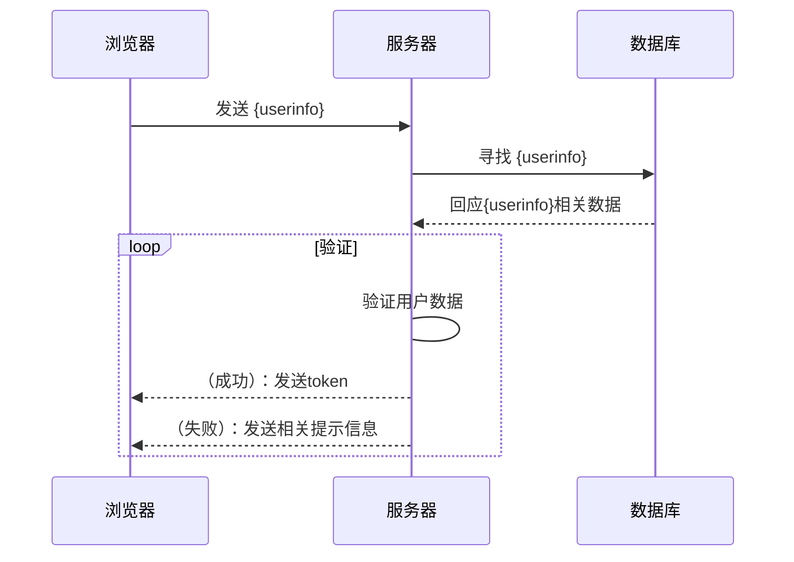

# UserAuth

网页服务器的用户认证组件，用于实现用户登录。

## 设计目标

希望这一组件能够提供尽可能多的用户安全管理策略和工具，并且各个功能可以尽量减少耦合，自由选择其中的部分功能去使用。

## 具体实现

### 子模块

#### 认证的基本流程

### 数据结构

`class userBasicInfo`

**用户基础数据**
用于存储最基础的用户信息，包含一个唯一的uid

* 用户名
* uid
* 密码相关信息

`class userSecurityInfo`

**用户安全数据**
包含用于保证账户安全的信息

* 连接到用户基础数据(一对一)
* 电子邮箱
* 手机号
* 密码保护
* 两步验证使用的随机数

`class userAdditionalSecurityInfo`

**额外的用户安全数据**
包含用户过去的安全记录

* 连接到用户基础数据(多对一)

`class userTokenInfo`

**存储用户相关的token信息**
token数据，可以存在多个

* 连接到用户基础数据
* token随机数
* 过期时间
* 上次使用此token的设备信息
